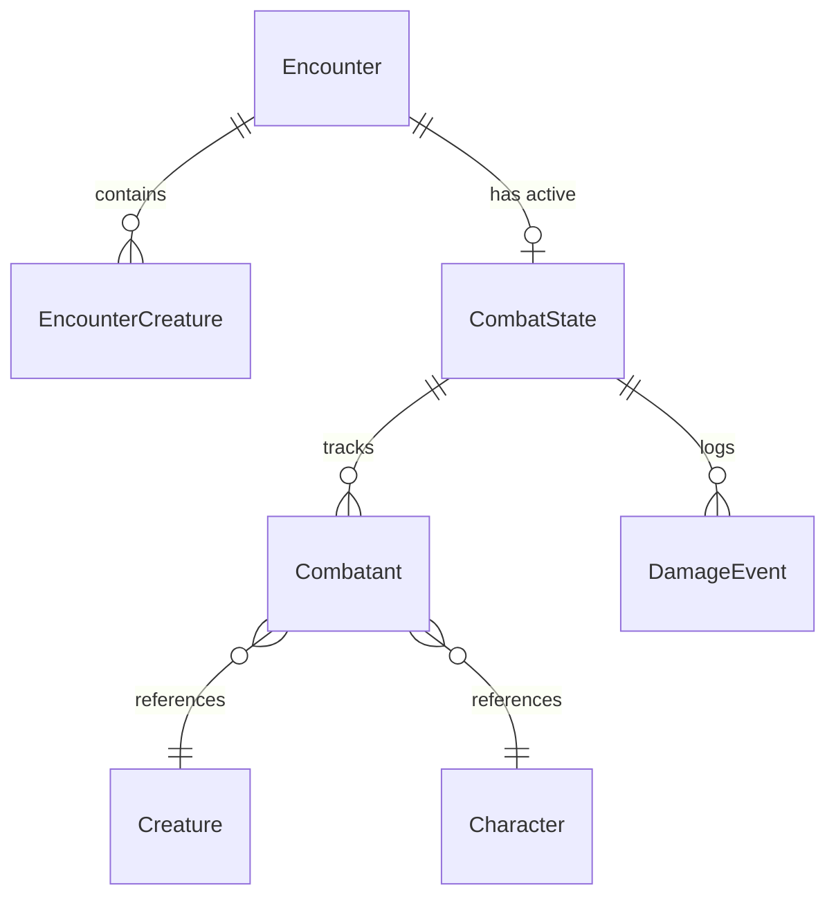
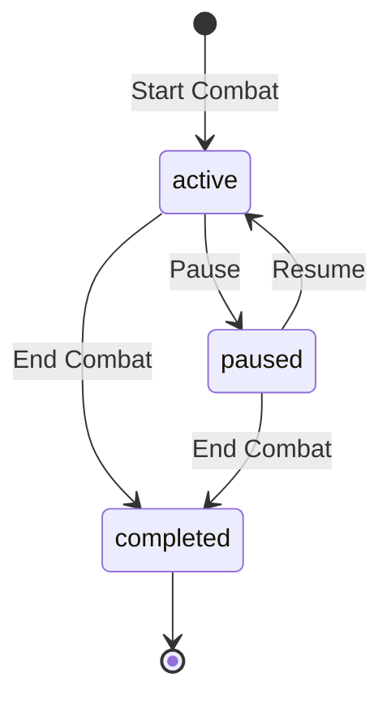
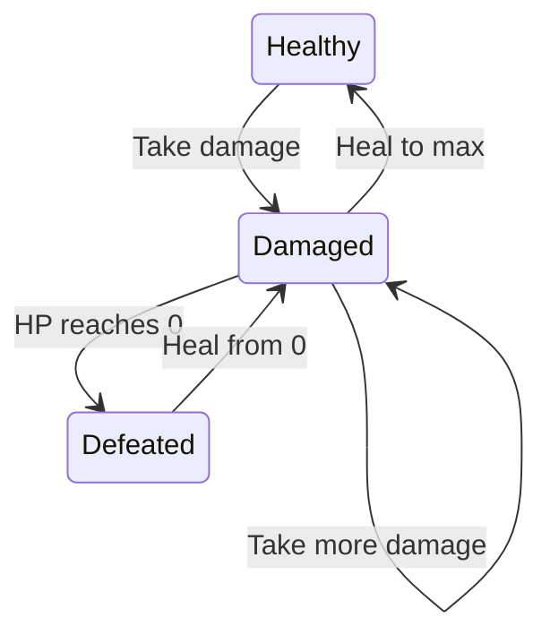

# Data Model: Encounter Builder and Combat Tracker

**Feature**: 009-encounter-builder  
**Date**: 2026-02-02

## Entity Overview



## Entities

### Encounter (existing, extended)

Represents a saved encounter configuration.

**Storage**: `campaign/encounters/{slug}.md`

| Field | Type | Description |
| ----- | ---- | ----------- |
| slug | string | URL-safe identifier (filename without .md) |
| name | string | Display name |
| difficulty | string | Calculated difficulty (Easy/Medium/Hard/Deadly) |
| partyLevel | number | Average party level used for calculation |
| partySize | number | Number of party members |
| totalXP | number | Adjusted XP total |
| creatures | EncounterCreature[] | List of creatures with quantities |

### EncounterCreature

A creature entry in an encounter (creature + quantity).

| Field | Type | Description |
| ----- | ---- | ----------- |
| name | string | Creature display name |
| slug | string | Reference slug for creature lookup |
| cr | string | Challenge Rating (e.g., "1/4", "5") |
| xp | number | XP value per creature |
| count | number | Number of this creature type |

### CombatState

The runtime state of an active combat session.

**Storage**: `campaign/encounters/combat-{encounter-slug}.json`

| Field | Type | Description |
| ----- | ---- | ----------- |
| encounterId | string | Slug of the source encounter |
| encounterName | string | Display name of the encounter |
| round | number | Current round number (starts at 1) |
| turn | number | Index into sorted combatants array |
| status | "active" \| "paused" \| "completed" | Combat status |
| startedAt | string | ISO timestamp when combat started |
| combatants | Combatant[] | All participants (monsters + players) |
| damageLog | DamageEvent[] | Chronological log of all damage/healing |

### Combatant

An individual participant in combat.

| Field | Type | Description |
| ----- | ---- | ----------- |
| id | string | Unique instance ID (e.g., "goblin-1", "player-meilin") |
| name | string | Display name (e.g., "Goblin 1", "Meilin Starwell") |
| type | "monster" \| "player" | Combatant category |
| creatureSlug | string? | Reference slug if monster |
| characterSlug | string? | Character slug if player |
| initiative | number | Initiative roll result |
| maxHP | number | Maximum hit points |
| currentHP | number | Current hit points |
| tempHP | number | Temporary hit points |
| conditions | string[] | Active conditions (Stunned, Poisoned, etc.) |
| isActive | boolean | True if this is the current turn |

**Validation Rules**:
- `currentHP` must be >= 0 and <= `maxHP`
- `tempHP` must be >= 0
- `initiative` must be >= 1
- At most one combatant can have `isActive = true`

### DamageEvent

A single damage, healing, or temp HP event.

| Field | Type | Description |
| ----- | ---- | ----------- |
| id | string | Unique event ID (e.g., "evt-{uuid}") |
| round | number | Round when event occurred |
| turn | number | Turn index when event occurred |
| targetId | string | Combatant ID that received damage/healing |
| targetName | string | Display name of target (for history display) |
| amount | number | Positive = damage, negative = healing (for type=damage/healing) |
| type | "damage" \| "healing" \| "temp_hp" | Event type |
| source | string? | Optional description (spell name, weapon, etc.) |
| timestamp | string | ISO timestamp when event occurred |

## TypeScript Types

```typescript
// frontend/src/types/index.ts (additions)

export interface EncounterCreature {
  name: string;
  slug: string;
  cr: string;
  xp: number;
  count: number;
}

export interface EncounterBuilderState {
  name: string;
  partyLevel: number;
  partySize: number;
  creatures: EncounterCreature[];
}

export interface Combatant {
  id: string;
  name: string;
  type: 'monster' | 'player';
  creatureSlug?: string;
  characterSlug?: string;
  initiative: number;
  maxHP: number;
  currentHP: number;
  tempHP: number;
  conditions: string[];
  isActive: boolean;
}

export interface DamageEvent {
  id: string;
  round: number;
  turn: number;
  targetId: string;
  targetName: string;
  amount: number;
  type: 'damage' | 'healing' | 'temp_hp';
  source?: string;
  timestamp: string;
}

export interface CombatState {
  encounterId: string;
  encounterName: string;
  round: number;
  turn: number;
  status: 'active' | 'paused' | 'completed';
  startedAt: string;
  combatants: Combatant[];
  damageLog: DamageEvent[];
}
```

## Pydantic Models

```python
# scripts/web/models/combat.py

from pydantic import BaseModel
from typing import Optional, Literal
from datetime import datetime


class Combatant(BaseModel):
    """Individual combat participant."""
    id: str
    name: str
    type: Literal["monster", "player"]
    creature_slug: Optional[str] = None
    character_slug: Optional[str] = None
    initiative: int
    max_hp: int
    current_hp: int
    temp_hp: int = 0
    conditions: list[str] = []
    is_active: bool = False


class DamageEvent(BaseModel):
    """Single damage/healing event."""
    id: str
    round: int
    turn: int
    target_id: str
    target_name: str
    amount: int
    type: Literal["damage", "healing", "temp_hp"]
    source: Optional[str] = None
    timestamp: str


class CombatState(BaseModel):
    """Full combat state for persistence."""
    encounter_id: str
    encounter_name: str
    round: int
    turn: int
    status: Literal["active", "paused", "completed"]
    started_at: str
    combatants: list[Combatant]
    damage_log: list[DamageEvent]


class CombatCreate(BaseModel):
    """Request to start combat from an encounter."""
    encounter_slug: str
    include_party: bool = True


class CombatAction(BaseModel):
    """Apply damage, healing, or temp HP."""
    target_id: str
    amount: int
    type: Literal["damage", "healing", "temp_hp"]
    source: Optional[str] = None


class InitiativeEntry(BaseModel):
    """Set initiative for a combatant."""
    combatant_id: str
    initiative: int
```

## State Transitions

### Combat Status



### Combatant HP


