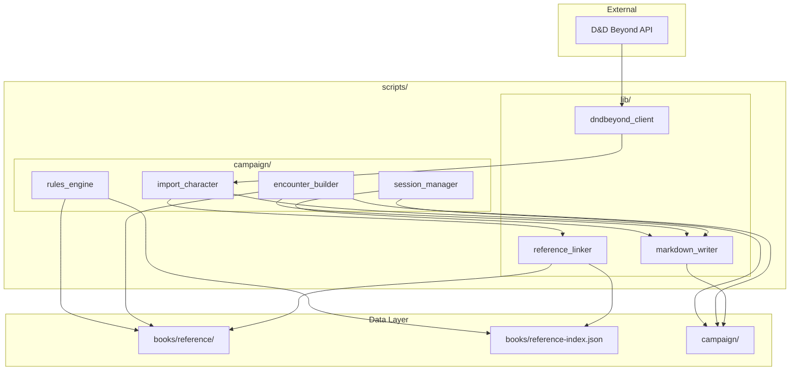

# Implementation Plan: Campaign Assistant

**Branch**: `1-campaign-assistant` | **Date**: 2026-01-28 | **Spec**: [spec.md](spec.md)
**Input**: Feature specification from `/specs/1-campaign-assistant/spec.md`

## Summary

Transform 5e-cursor from a static reference library into a living campaign assistant by adding:
1. D&D Beyond character import with auto-linking to reference data
2. DMG-based encounter builder using extracted creature data
3. Rules arbitration with inline-quoted citations
4. Session summary tracking for campaign history

All campaign data stored as markdown in `campaign/` directory, optimized for AI context.

## Technical Context

**Language/Version**: Python 3.11+ (consistent with existing extraction scripts)  
**Primary Dependencies**: requests (HTTP client), existing extraction infrastructure  
**Storage**: Markdown files in `campaign/` directory, JSON indexes for lookups  
**Testing**: pytest (consistent with user preferences)  
**Target Platform**: Local filesystem, Cursor AI integration  
**Project Type**: Single project - CLI scripts and library modules  
**Performance Goals**: Character import <30s, encounter generation <5s, rules lookup <2s  
**Constraints**: All data human-readable markdown, git-trackable, AI-parseable  
**Scale/Scope**: Single campaign, 4-6 party members, hundreds of sessions over campaign lifetime

## Constitution Check

*GATE: Must pass before Phase 0 research. Re-check after Phase 1 design.*

| Principle | Status | Evidence |
|-----------|--------|----------|
| I. AI-First Design | ✅ Pass | All output is markdown optimized for AI context; indexes enable fast lookups |
| II. Reference as Foundation | ✅ Pass | Campaign entities link to `books/reference/`; reference data unchanged |
| III. Campaign as Living State | ✅ Pass | Campaign data separate in `campaign/`; history append-only |
| IV. DM as Final Authority | ✅ Pass | All outputs are suggestions; source citations provided |
| V. Markdown as Truth | ✅ Pass | All persistent data is markdown or JSON |
| VI. Modular Extraction | ✅ Pass | Each feature independently usable; modular script design |

## Project Structure

### Documentation (this feature)

```text
specs/1-campaign-assistant/
├── spec.md              # Feature specification
├── plan.md              # This file
├── research.md          # D&D Beyond API, DMG guidelines
├── data-model.md        # Entity definitions
├── quickstart.md        # Integration guide
├── checklists/
│   └── requirements.md  # Spec quality checklist
└── tasks.md             # Task breakdown (created by /speckit.tasks)
```

### Source Code (repository root)

```text
scripts/
├── extract_all.py           # Existing - reference extraction
├── extract_book.py          # Existing - book extraction library
├── extractors/              # Existing - category extractors
│   └── ...
├── campaign/                # NEW - campaign management scripts
│   ├── __init__.py
│   ├── import_character.py  # D&D Beyond character import
│   ├── encounter_builder.py # Encounter generation
│   ├── rules_engine.py      # Rules lookup with citations
│   └── session_manager.py   # Session summary management
└── lib/                     # NEW - shared utilities
    ├── __init__.py
    ├── dndbeyond_client.py  # D&D Beyond API client
    ├── reference_linker.py  # Auto-link to reference data
    └── markdown_writer.py   # Consistent markdown output

campaign/                    # NEW - campaign data (gitignored by default)
├── campaign.md              # Campaign overview
├── party/
│   ├── index.md             # Party summary
│   └── characters/
│       └── *.md             # Character sheets
├── npcs/
│   ├── index.md             # NPC directory
│   └── *.md                 # NPC files
├── locations/
│   ├── index.md             # Location directory
│   └── *.md                 # Location files
├── sessions/
│   ├── index.md             # Session log
│   └── session-*.md         # Session summaries
└── encounters/
    ├── index.md             # Saved encounters
    └── *.md                 # Encounter files

tests/
├── test_import_character.py
├── test_encounter_builder.py
├── test_rules_engine.py
└── fixtures/
    └── dndbeyond_sample.json  # Sample API response
```

**Structure Decision**: Single project extending existing `scripts/` directory with new `campaign/` module. Campaign data stored at repository root in `campaign/` directory (separate from `books/` reference data). Shared utilities in `scripts/lib/`.

## Architecture Overview



## Key Design Decisions

### 1. D&D Beyond Import Flow

1. User provides character URL (e.g., `https://www.dndbeyond.com/characters/157884334`)
2. Extract character ID from URL
3. Fetch JSON from `https://character-service.dndbeyond.com/character/v5/character/{id}`
4. Parse JSON into internal character model
5. Use `reference_linker` to map names to reference file paths
6. Generate markdown using `markdown_writer`
7. Save to `campaign/party/characters/{slug}.md`
8. Update `campaign/party/index.md`

### 2. Encounter Builder Algorithm

1. Calculate party XP thresholds from DMG table (sum per-character thresholds)
2. Query creatures from `books/reference/creatures/` filtered by:
   - CR range (based on party level)
   - Type filter (optional)
   - Environment filter (optional)
3. Select creatures whose adjusted XP (with multiplier) falls within target difficulty
4. Generate markdown with creature links and XP breakdown
5. Optionally save to `campaign/encounters/`

### 3. Rules Lookup Strategy

1. Parse question for keywords (condition names, rule terms, spell names)
2. Search `books/reference-index.json` for matching entries
3. Load relevant markdown files
4. Extract relevant sections
5. Format response with inline quotes and source citations

### 4. Reference Linking

The `reference_linker` module:
1. Loads `books/reference-index.json` once
2. Builds name-to-path lookup dictionary
3. Handles fuzzy matching for slight name variations
4. Returns relative path from caller's location

## Complexity Tracking

No constitution violations requiring justification.

## Dependencies

### External
- D&D Beyond character API (public access for public characters)
- Network connectivity for character imports

### Internal
- `books/reference-index.json` must exist (run `make extract` first)
- `books/reference/` directory structure from extraction

### Python Packages
- `requests` - HTTP client for D&D Beyond API (already in typical environments)

## Risk Assessment

| Risk | Likelihood | Impact | Mitigation |
|------|------------|--------|------------|
| D&D Beyond API changes | Low | High | Version response schema; graceful degradation on unknown fields |
| Private character access | N/A | N/A | Clear error message explaining public requirement |
| Reference data missing | Low | Medium | Check for `books/` existence before campaign operations |
| Large character JSON | Low | Low | Stream processing if needed; typical characters <500KB |
