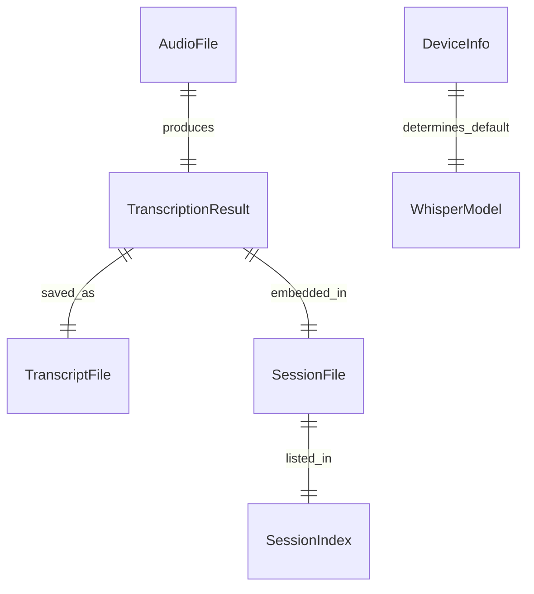

# Data Model: Session Transcription

**Feature**: Session Transcription  
**Spec**: [spec.md](spec.md)  
**Plan**: [plan.md](plan.md)

## Entities

### AudioFile (Input)

Represents the audio recording to be transcribed.

| Attribute | Type | Description |
|-----------|------|-------------|
| path | Path | Absolute or relative path to audio file |
| format | str | Audio format (mp3, wav, m4a, etc.) |
| duration | float | Duration in seconds (optional, for progress) |

**Supported Formats**: mp3, wav, m4a, flac, ogg, webm (any format ffmpeg can decode)

**Validation**:
- File must exist
- File must be readable
- Format must be supported by ffmpeg

---

### TranscriptionResult

Represents the output from Whisper transcription.

| Attribute | Type | Description |
|-----------|------|-------------|
| text | str | Full transcript text |
| language | str | Detected language code (e.g., "en") |
| segments | list | Time-stamped segments (optional, for future use) |

**Source**: Whisper's `model.transcribe()` returns a dict with these fields.

---

### TranscriptFile

Represents the saved raw transcript file.

| Attribute | Type | Description |
|-----------|------|-------------|
| path | Path | Path to transcript file |
| session_number | int | Associated session number |
| content | str | Raw transcript text |

**Location**: `campaign/sessions/transcripts/session-NNN.txt`

**Format**: Plain text, no markdown formatting.

---

### SessionFile (Extended)

Extends the existing session file format with transcript metadata.

| Attribute | Type | Description |
|-----------|------|-------------|
| path | Path | Path to session markdown file |
| session_number | int | Session number (001, 002, etc.) |
| title | str | Session title |
| date | str | ISO date of transcription |
| audio_source | str | Original audio filename |
| model | str | Whisper model used |
| transcript | str | Full transcript text |

**Location**: `campaign/sessions/session-NNN.md`

**Format**: Markdown with standard session sections plus transcript.

---

### DeviceInfo

Represents detected hardware capabilities.

| Attribute | Type | Description |
|-----------|------|-------------|
| device | str | Device type: "cuda", "mps", or "cpu" |
| has_gpu | bool | Whether GPU acceleration is available |
| default_model | str | Recommended model for this device |

**Detection Logic**:
```python
cuda_available = torch.cuda.is_available()      # NVIDIA GPU
mps_available = torch.backends.mps.is_available()  # Apple Silicon
```

---

### WhisperModel

Represents available Whisper models.

| Model | Size | Quality | Default For |
|-------|------|---------|-------------|
| tiny | 39MB | Basic | Quick test |
| base | 74MB | Good | Short audio |
| small | 244MB | Better | CPU (no GPU) |
| medium | 769MB | Great | Manual choice |
| large | 1.5GB | Highest | GPU (CUDA/MPS) |

**Valid Values**: `["tiny", "base", "small", "medium", "large"]`

---

## File Structure

```text
campaign/
└── sessions/
    ├── index.md                 # Session log (updated)
    ├── session-001.md           # Session file with transcript
    ├── session-002.md
    └── transcripts/             # NEW directory
        ├── session-001.txt      # Raw transcript
        └── session-002.txt
```

## Session File Template

```markdown
# Session {number}: {title}

**Date**: {date}  
**Session Number**: {number}  
**Audio Source**: {audio_filename}  
**Transcription Model**: {model}

---

## Summary

*Ask Cursor AI to summarize the transcript below*

## Key Events

*Ask Cursor AI to extract key events from the transcript*

## NPCs Encountered

*Ask Cursor AI to identify NPCs mentioned*

## Locations Visited

*Ask Cursor AI to identify locations visited*

## Loot & Rewards

*Ask Cursor AI to identify any loot or rewards*

## Notes for Next Session

*Ask Cursor AI to identify hooks and cliffhangers*

---

## Transcript

> Full transcript below. Ask AI: "Analyze this session transcript and fill in the sections above"

{transcript_text}

---

*Session created from audio transcription on {date}*  
*Transcript: campaign/sessions/transcripts/session-{number:03d}.txt*
```

## Relationships



## Constraints

1. **Session numbers are unique**: No duplicate session-NNN files
2. **Transcript files mirror session files**: session-005.md ↔ transcripts/session-005.txt
3. **Models are validated**: Only valid Whisper model names accepted
4. **Paths are resolved**: Relative paths converted to absolute before processing
