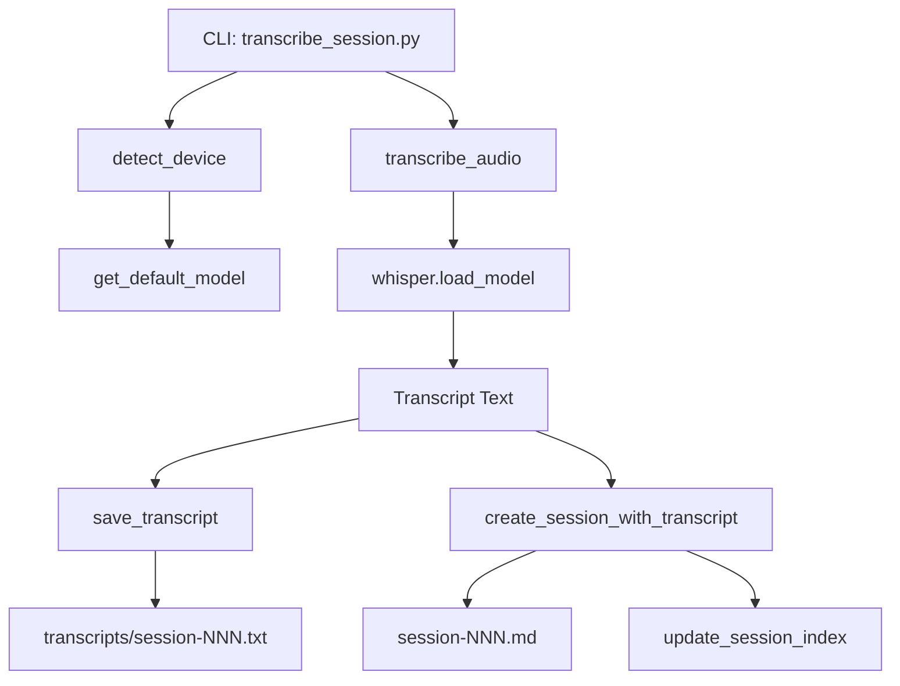

# Implementation Plan: Session Transcription

**Branch**: `4-session-transcription` | **Date**: 2026-02-02 | **Spec**: [spec.md](spec.md)
**Input**: Feature specification from `/specs/4-session-transcription/spec.md`

## Summary

Implement a session transcription tool that uses local Whisper to convert D&D session audio recordings into text transcripts, creating session files that Cursor AI can then analyze into structured notes.

## Technical Context

**Language/Version**: Python 3.11+  
**Primary Dependencies**: openai-whisper, torch  
**Storage**: Markdown files in campaign/sessions/  
**Testing**: pytest with mocked Whisper calls  
**Target Platform**: macOS (Apple Silicon), Linux (CUDA), Windows (CUDA)  
**Project Type**: Single project - extends existing campaign management tools  
**Performance Goals**: Transcribe 1-hour audio in <30 min (GPU) or <2 hours (CPU)  
**Constraints**: Requires ffmpeg system dependency, model download on first use  
**Scale/Scope**: Single audio file processing, session-at-a-time workflow

## Constitution Check

*GATE: Must pass before Phase 0 research. Re-check after Phase 1 design.*

- [x] Single responsibility: One script for transcription
- [x] No hardcoded secrets: No API keys needed (local Whisper)
- [x] Follows existing patterns: Matches session_manager.py CLI structure
- [x] Error handling: Clear messages for missing files, dependencies
- [x] Testing: Unit tests with mocked Whisper
- [x] Documentation: Docstrings and usage examples

## Project Structure

### Documentation (this feature)

```text
specs/4-session-transcription/
├── spec.md              # Feature specification
├── plan.md              # This file
├── data-model.md        # Entity definitions
├── research.md          # Whisper integration research
├── quickstart.md        # Usage guide
└── tasks.md             # Implementation tasks
```

### Source Code (repository root)

```text
scripts/
├── campaign/
│   ├── transcribe_session.py    # NEW: Main transcription script
│   └── session_manager.py       # Existing (reuse patterns)
└── lib/
    └── markdown_writer.py       # Existing (reuse utilities)

campaign/
└── sessions/
    ├── index.md                 # Existing session index
    ├── session-NNN.md           # Session files (existing format + transcript)
    └── transcripts/             # NEW: Raw transcript storage
        └── session-NNN.txt

tests/
└── test_transcribe_session.py   # NEW: Unit tests
```

**Structure Decision**: Extends existing campaign management structure. New script follows established patterns from session_manager.py, encounter_builder.py, and loot_generator.py.

## Architecture



## Core Components

### 1. Hardware Detection

```python
def detect_device() -> str:
    """Detect best available device for Whisper."""
    import torch
    if torch.cuda.is_available():
        return "cuda"
    elif torch.backends.mps.is_available():
        return "mps"
    else:
        return "cpu"

def get_default_model(device: str) -> str:
    """Determine best default model based on hardware."""
    if device in ("cuda", "mps"):
        return "large"
    else:
        return "small"
```

### 2. Transcription

```python
def transcribe_audio(audio_path: Path, model_name: str, device: str) -> str:
    """Transcribe audio file using Whisper."""
    import whisper
    model = whisper.load_model(model_name, device=device)
    result = model.transcribe(str(audio_path))
    return result["text"]
```

### 3. Session Creation

Reuses patterns from session_manager.py:
- `get_next_session_number()` - Auto-increment session number
- `update_session_index()` - Add to session log
- `markdown_writer` utilities for consistent formatting

### 4. CLI Interface

```bash
# Basic usage
python scripts/campaign/transcribe_session.py "recording.mp3" --title "The Dragon's Lair"

# With model override
python scripts/campaign/transcribe_session.py recording.mp3 --model medium

# With explicit session number
python scripts/campaign/transcribe_session.py recording.mp3 --title "Cave Exploration" --number 5
```

## Session File Format

The generated session file includes:

1. **Metadata**: Date, session number, audio source, model used
2. **Placeholder sections**: Summary, Key Events, NPCs, Locations, Loot, Notes
3. **Transcript section**: Full transcript for AI analysis
4. **Footer**: Creation timestamp and transcript file reference

## Error Handling

| Error | Detection | Message |
|-------|-----------|---------|
| Missing audio file | Path.exists() | "Audio file not found: {path}" |
| Invalid audio format | Whisper exception | "Could not process audio file. Ensure ffmpeg is installed." |
| Missing ffmpeg | Whisper exception | "ffmpeg not found. Install with: brew install ffmpeg" |
| No campaign directory | Path.exists() | "Campaign directory not found. Run init_campaign.py first." |
| Model download needed | First-run | "Downloading Whisper model '{model}' (~{size}). This may take a few minutes." |

## Testing Strategy

- **Unit tests**: Mock whisper.load_model and model.transcribe
- **Integration tests**: Test file creation, index updates
- **No actual transcription in tests**: Avoid slow/heavy operations in CI

## Dependencies

Add to requirements.txt:

```text
openai-whisper>=20231117
```

Note: openai-whisper pulls in torch as a dependency.

System dependency (not in requirements.txt):
- `ffmpeg`: `brew install ffmpeg` (macOS) or `apt install ffmpeg` (Linux)
