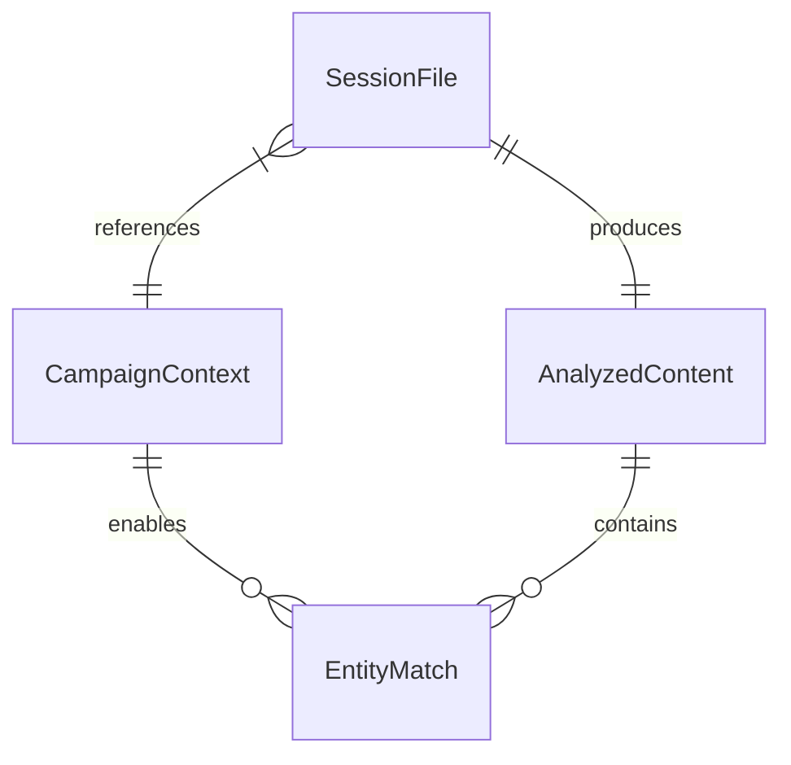

# Data Model: Session Transcript Analyzer

**Feature**: Session Transcript Analyzer  
**Spec**: [spec.md](spec.md)  
**Plan**: [plan.md](plan.md)

## Entities

### SessionFile (Input/Output)

The session markdown file being analyzed and updated.

| Attribute | Type | Description |
|-----------|------|-------------|
| path | Path | Path to session markdown file |
| session_number | int | Session number (001, 002, etc.) |
| title | str | Session title from heading |
| metadata | dict | Date, Audio Source, Transcription Model |
| transcript | str | Full transcript text from Transcript section |
| sections | dict | Structured sections to be populated |

**Location**: `campaign/sessions/session-NNN.md`

**Sections**:
- Summary
- Key Events
- NPCs Encountered
- Locations Visited
- Loot & Rewards
- Notes for Next Session
- Transcript (preserved, not modified)

---

### CampaignContext

Campaign data used for entity linking.

| Attribute | Type | Description |
|-----------|------|-------------|
| npcs | list[str] | NPC names from npcs/index.md |
| locations | list[str] | Location names from locations/index.md |
| party_members | list[str] | Character names from party/index.md |

**Source Files**:
- `campaign/npcs/index.md`
- `campaign/locations/index.md`
- `campaign/party/index.md`

---

### EntityMatch

Result of matching a mentioned name to existing campaign data.

| Attribute | Type | Description |
|-----------|------|-------------|
| name | str | Entity name as mentioned in transcript |
| entity_type | str | "npc", "location", or "party" |
| exists | bool | Whether entity exists in campaign data |
| file_path | str | Relative path to entity file (if exists) |

**Link Format** (when exists=True):
```markdown
[Entity Name](../npcs/entity-name.md)
[Location Name](../locations/location-name.md)
```

**New Format** (when exists=False):
```markdown
Entity Name (NEW)
```

---

### AnalyzedContent

Structured content extracted from transcript analysis.

| Attribute | Type | Description |
|-----------|------|-------------|
| summary | str | 2-3 paragraph narrative overview |
| key_events | list[str] | Bullet points of significant moments |
| npcs | list[EntityMatch] | NPCs mentioned with match status |
| locations | list[EntityMatch] | Locations mentioned with match status |
| loot | list[str] | Items, treasure, gold received |
| notes | list[str] | Plot hooks, cliffhangers, threads |

---

## File Structure

```text
campaign/
├── npcs/
│   └── index.md           # NPC roster for matching
├── locations/
│   └── index.md           # Location list for matching
├── party/
│   └── index.md           # Party roster (exclude from NPCs)
└── sessions/
    ├── session-001.md     # Session to analyze
    └── transcripts/
        └── session-001.txt  # Raw transcript backup
```

## Section Templates

### Before Analysis (Placeholder)

```markdown
## Summary

*Ask Cursor AI to summarize the transcript below*

## Key Events

*Ask Cursor AI to extract key events from the transcript*
```

### After Analysis (Populated)

```markdown
## Summary

The party began the session by returning to the village of Millbrook after their harrowing escape from the goblin caves. They immediately sought out the blacksmith to repair their damaged equipment...

[2-3 paragraphs of narrative summary]

## Key Events

- Party arrived in Millbrook and visited the blacksmith
- Discovered a mysterious letter from the Duke
- Confronted the innkeeper about the strange disappearances
- Found a secret passage beneath the tavern
- Rescued two prisoners and learned about the cult's plans
```

### NPC Section Examples

```markdown
## NPCs Encountered

- [Grimbold the Blacksmith](../npcs/grimbold-the-blacksmith.md) - Repaired party's armor
- [Innkeeper Martha](../npcs/innkeeper-martha.md) - Acted suspiciously
- Cultist Leader Vex (NEW) - Escaped through the passage
- Prisoner Aldric (NEW) - Provided information about the cult
```

### Location Section Examples

```markdown
## Locations Visited

- [Millbrook](../locations/millbrook.md) - Village center
- [The Rusty Nail Tavern](../locations/the-rusty-nail-tavern.md) - Secret passage discovered
- Cult Hideout Beneath Tavern (NEW) - Underground chamber
```

## Relationships



## Constraints

1. **Transcript preserved**: Original transcript section is never modified
2. **Metadata preserved**: Date, Session Number, Audio Source, Model are never modified
3. **Party exclusion**: Names in party/index.md are not added to NPCs Encountered
4. **Case-insensitive matching**: "grimbold" matches "Grimbold"
5. **Fuzzy matching optional**: Exact matches preferred, fuzzy as fallback
