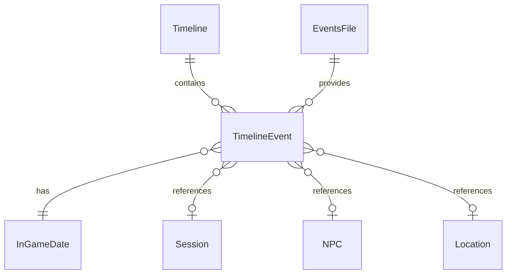

# Data Model: Campaign Timeline

**Feature**: Campaign Timeline  
**Spec**: [spec.md](spec.md)  
**Plan**: [plan.md](plan.md)

## Entities

### InGameDate

Represents a point in time within the campaign world.

| Attribute | Type | Description |
|-----------|------|-------------|
| day | int | Days since campaign start (1-indexed) |

**Format**: "Day N" (e.g., "Day 1", "Day 15", "Day 100")

**Parsing Rules**:
- Case-insensitive: "day 15", "Day 15", "DAY 15" all valid
- Whitespace flexible: "Day15", "Day 15", "Day  15" all valid
- Must be positive integer

**Examples**:
```python
InGameDate(day=1)   # Day 1 - campaign start
InGameDate(day=15)  # Day 15
InGameDate(day=100) # Day 100
```

---

### TimelineEvent

Represents a single event in the campaign timeline.

| Attribute | Type | Description |
|-----------|------|-------------|
| in_game_date | InGameDate | When the event occurred in-game |
| real_date | str | None | Real-world date (ISO format, optional) |
| title | str | Event title/description |
| category | str | Event type (session, npc, location, battle, plot, etc.) |
| session_number | int | None | Related session number (optional) |
| entity_path | str | None | Relative path to entity file (optional) |
| source | str | Where this event came from (session, npc, location, events.md) |

**Categories**:
- `session` - Session summary
- `npc` - NPC first appearance
- `location` - Location discovery
- `battle` - Combat encounter
- `plot` - Story/plot development
- `discovery` - Item/secret found
- `start` - Campaign start
- `custom` - User-defined

---

### EventsFile

Represents the custom events file.

| Attribute | Type | Description |
|-----------|------|-------------|
| path | Path | Path to events.md |
| events | list[TimelineEvent] | Parsed events from table |

**Location**: `campaign/events.md`

**Table Format**:
```markdown
| In-Game Date | Event | Session | Category |
| ------------ | ----- | ------- | -------- |
| Day 1 | Campaign begins | 1 | start |
| Day 5 | Defeated goblin chief | 2 | battle |
```

---

### Timeline

Represents the complete campaign timeline.

| Attribute | Type | Description |
|-----------|------|-------------|
| campaign_name | str | Campaign name from campaign.md |
| current_day | int | Most recent in-game date |
| events | list[TimelineEvent] | All events sorted by in_game_date |
| generated_date | str | When timeline was generated |

---

## File Structures

### Session with In-Game Date

```markdown
# Session 5: The Dragon's Lair

**Date**: 2026-02-02  
**In-Game Date**: Day 15  
**Session Number**: 5

---

## Summary
...
```

### NPC with First Appearance

```markdown
# Grimbold the Blacksmith

**Role**: Ally  
**First Appearance**: Day 5 (Session 2)  
**Location**: Millbrook

---

## Description
...
```

### Location with Discovery Date

```markdown
# Goblin Caves

**Type**: Dungeon  
**Discovered**: Day 5 (Session 2)

---

## Description
...
```

### Timeline Output

```markdown
# Campaign Timeline

**Campaign**: The Dragon's Shadow  
**Current Day**: Day 25  
**Sessions**: 5  
**Generated**: 2026-02-02

---

## Day 1

**Real Date**: 2026-01-15

### Session 1: A New Beginning

Campaign begins in the village of Millbrook.

**Events**:
- Campaign begins

---

## Day 5

**Real Date**: 2026-01-22

### Session 2: Into the Caves

**Events**:
- [Grimbold the Blacksmith](npcs/grimbold-the-blacksmith.md) first appears
- [Goblin Caves](locations/goblin-caves.md) discovered
- Battle: Defeated Chief Skrag

---

*Timeline generated on 2026-02-02*
```

## Relationships



## Constraints

1. **In-game dates are positive**: Day must be >= 1
2. **Events sorted by day**: Timeline events ordered by in_game_date.day
3. **Entity paths are relative**: Links use relative paths from campaign/
4. **Timeline is regenerable**: Running generator overwrites timeline.md
5. **Optional fields**: in_game_date, first_appearance, discovered are all optional
