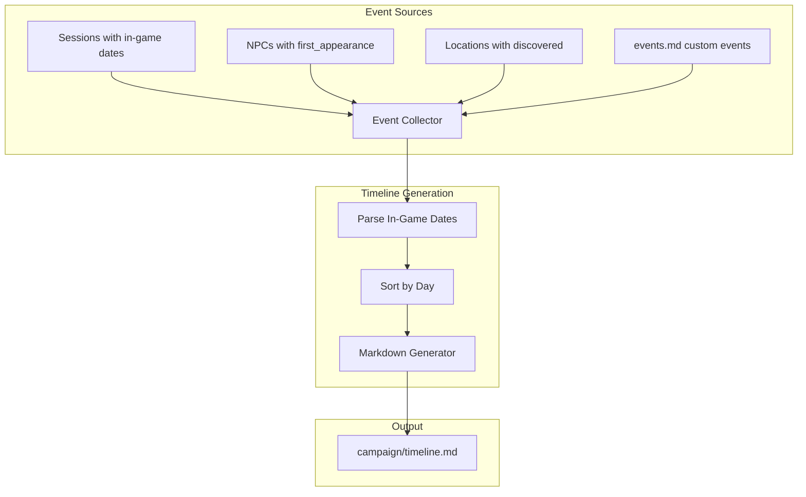

# Implementation Plan: Campaign Timeline

**Branch**: `6-campaign-timeline` | **Date**: 2026-02-02 | **Spec**: [spec.md](spec.md)

## Summary

Implement a campaign timeline system with in-game date tracking for sessions/entities, custom events file, and a timeline generator that produces `campaign/timeline.md`.

## Technical Context

**Language/Version**: Python 3.11+  
**Storage**: Markdown files in campaign/  
**Testing**: pytest with file fixtures  
**Dependencies**: Existing campaign management scripts

## Architecture



## Core Components

### 1. In-Game Date Utilities

**File**: `scripts/lib/campaign_calendar.py`

```python
import re
from dataclasses import dataclass

@dataclass
class InGameDate:
    day: int

def parse_in_game_date(s: str) -> InGameDate | None:
    """Parse 'Day 15' or 'Day15' into InGameDate."""
    match = re.match(r"[Dd]ay\s*(\d+)", s.strip())
    if match:
        return InGameDate(day=int(match.group(1)))
    return None

def format_in_game_date(d: InGameDate) -> str:
    """Format as 'Day 15'."""
    return f"Day {d.day}"
```

### 2. Session Manager Update

**File**: `scripts/campaign/session_manager.py`

Add `--in-game-date` argument:

```python
parser.add_argument("--in-game-date", help="In-game date (e.g., 'Day 15')")
```

Session template adds:
```markdown
**Date**: 2026-02-02  
**In-Game Date**: Day 15  
**Session Number**: 5
```

### 3. Campaign Manager Update

**File**: `scripts/campaign/campaign_manager.py`

Add options to `add-npc` and `add-location`:

```python
# For NPCs
parser.add_argument("--first-seen", help="In-game date of first appearance")

# For locations
parser.add_argument("--discovered", help="In-game date when discovered")
```

### 4. Events File Template

**File**: `campaign/events.md` (created by init_campaign.py)

```markdown
# Campaign Events

Add major campaign events here. These appear in the timeline.

| In-Game Date | Event | Session | Category |
| ------------ | ----- | ------- | -------- |
| Day 1 | Campaign begins | 1 | start |

## Categories

- `start` - Campaign start
- `battle` - Major combat
- `plot` - Story development
- `discovery` - Important find
- `custom` - Other events
```

### 5. Timeline Generator

**File**: `scripts/campaign/timeline_generator.py`

```python
def collect_session_events(sessions_dir: Path) -> list[TimelineEvent]:
    """Extract events from session files with in-game dates."""

def collect_npc_events(npcs_dir: Path) -> list[TimelineEvent]:
    """Extract NPC first appearances."""

def collect_location_events(locations_dir: Path) -> list[TimelineEvent]:
    """Extract location discoveries."""

def collect_custom_events(events_path: Path) -> list[TimelineEvent]:
    """Parse events.md table."""

def generate_timeline(campaign_dir: Path, output_path: Path) -> None:
    """Aggregate all events, sort, and write timeline.md."""
```

### 6. Timeline Output

**File**: `campaign/timeline.md` (generated)

```markdown
# Campaign Timeline

**Campaign**: The Dragon's Shadow  
**Current Day**: Day 25

---

## Day 1

**Session 1**: A New Beginning  
- Campaign begins in Millbrook

## Day 5

**Session 2**: The Goblin Caves  
- [Grimbold the Blacksmith](npcs/grimbold-the-blacksmith.md) first appears
- [Goblin Caves](locations/goblin-caves.md) discovered
- Battle: Defeated Chief Skrag

...

---

*Timeline generated on 2026-02-02*
```

## File Changes

| File | Change |
|------|--------|
| `scripts/lib/campaign_calendar.py` | NEW - In-game date utilities |
| `scripts/campaign/timeline_generator.py` | NEW - Timeline generation CLI |
| `scripts/campaign/session_manager.py` | UPDATE - Add --in-game-date |
| `scripts/campaign/campaign_manager.py` | UPDATE - Add --first-seen, --discovered |
| `scripts/campaign/init_campaign.py` | UPDATE - Create events.md |
| `campaign/events.md` | NEW (template) |
| `campaign/timeline.md` | NEW (generated) |
| `.cursor/rules/campaign-lookup.mdc` | UPDATE - Document timeline |
| `tests/test_timeline_generator.py` | NEW - Unit tests |

## Testing Strategy

- **Unit tests**: Test date parsing, event collection, sorting
- **Integration tests**: Test full timeline generation with fixtures
- **File fixtures**: Sample sessions, NPCs, locations with dates
