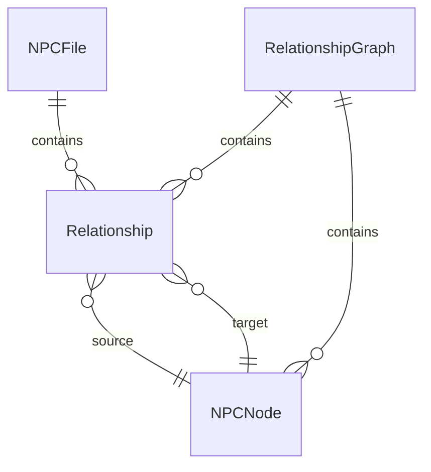

# Data Model: NPC Relationship Graph

**Feature**: NPC Relationship Graph  
**Spec**: [spec.md](spec.md)  
**Plan**: [plan.md](plan.md)

## Entities

### Relationship

Represents a connection between two NPCs.

| Attribute | Type | Description |
|-----------|------|-------------|
| source_name | str | Name of the source NPC |
| source_file | str | None | Filename of source NPC (if known) |
| target_name | str | Name of the target NPC |
| target_file | str | None | Filename of target NPC (if linked) |
| relationship_type | str | Type of relationship |
| description | str | Freeform description of the relationship |

**Example**:
```python
Relationship(
    source_name="Elara the Wise",
    source_file="elara-the-wise.md",
    target_name="Grimbold",
    target_file="grimbold.md",
    relationship_type="ally",
    description="Childhood friends, trusts completely"
)
```

---

### RelationshipType

Valid relationship types.

| Type | Description | Inverse |
|------|-------------|---------|
| ally | Friendly, cooperative | ally |
| enemy | Hostile, adversarial | enemy |
| family | Blood or marriage relation | family |
| employer | Works for this person | employee |
| employee | This person works for them | employer |
| rival | Competitive relationship | rival |
| neutral | Knows but no strong feelings | neutral |
| romantic | Love interest | romantic |
| mentor | Teacher | student |
| student | Learner | mentor |

---

### NPCNode

Represents an NPC in the graph.

| Attribute | Type | Description |
|-----------|------|-------------|
| name | str | NPC name |
| slug | str | Slugified name for Mermaid node ID |
| file_path | str | None | Path to NPC file |
| relationships | list[Relationship] | Outgoing relationships |

---

### RelationshipGraph

Represents the complete NPC relationship graph.

| Attribute | Type | Description |
|-----------|------|-------------|
| nodes | dict[str, NPCNode] | Map of slug to NPCNode |
| edges | list[Relationship] | All relationships |
| generated_date | str | When graph was generated |

---

## File Formats

### Connections Section (in NPC files)

```markdown
## Connections

- [Target Name](target-file.md) | type | description
- Target Name Without Link | type | description
```

**Parsing Rules**:
- Each line starts with `- `
- Name can be plain text or markdown link
- Pipe `|` separates name, type, and description
- Type is required, description is optional
- Extra whitespace around pipes is trimmed

### Relationship Graph Output

```markdown
# NPC Relationships

**Generated**: 2026-02-02  
**NPCs**: 12  
**Connections**: 18


## Legend

| Type | Meaning |
|------|---------|
| ally | Friendly, cooperative |
| enemy | Hostile, adversarial |
...
```

## Relationships



## Constraints

1. **Relationship types are case-insensitive**: "Ally" and "ally" are equivalent
2. **Node slugs are unique**: Derived from NPC name using slugify
3. **Self-relationships are ignored**: An NPC cannot have a relationship with itself
4. **Description is optional**: Type is required, description can be empty
5. **Unknown types are allowed**: Non-standard types are accepted with a warning
