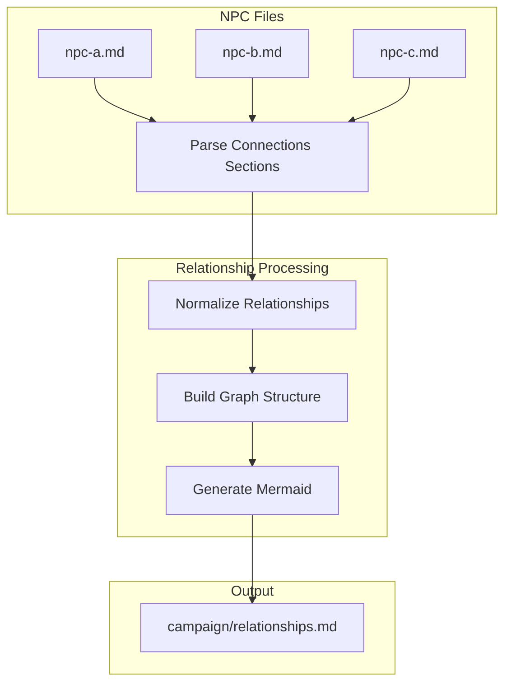
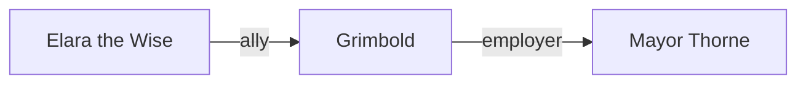

# Implementation Plan: NPC Relationship Graph

**Branch**: `7-npc-relationships` | **Date**: 2026-02-02 | **Spec**: [spec.md](spec.md)

## Summary

Add structured relationship tracking to NPCs and generate a visual Mermaid diagram showing all NPC connections. Relationships are typed (ally, enemy, family, etc.) with optional descriptions.

## Technical Context

**Language/Version**: Python 3.11+  
**Storage**: Markdown files in campaign/npcs/ and campaign/relationships.md  
**Testing**: pytest with file fixtures  
**Dependencies**: Existing campaign management scripts

## Architecture



## Relationship Format

Update the `## Connections` section in NPC files to use a structured format:

```markdown
## Connections

- [Grimbold the Blacksmith](grimbold-the-blacksmith.md) | ally | Childhood friend, trusts completely
- [Mayor Thorne](mayor-thorne.md) | employer | Works as the mayor's enforcer
- The Shadow Guild | enemy | Hunted for past crimes
```

**Format**: `- [Name](file.md) | type | description` or `- Name | type | description`

**Relationship Types**:
- `ally` - Friendly, cooperative
- `enemy` - Hostile, adversarial
- `family` - Blood or marriage relation
- `employer` - Works for this person
- `employee` - This person works for them
- `rival` - Competitive relationship
- `neutral` - Knows but no strong feelings
- `romantic` - Love interest
- `mentor` - Teacher/student relationship

## Components

### 1. Relationship Parser

**File**: `scripts/lib/relationship_parser.py`

- Parse NPC files for `## Connections` sections
- Extract relationships with type and description
- Handle both linked `[Name](file.md)` and plain `Name` formats
- Validate relationship types

### 2. Graph Generator

**File**: `scripts/campaign/relationship_graph.py`

CLI tool that:
- Scans all NPCs in `campaign/npcs/`
- Parses relationships from each NPC
- Builds graph structure
- Generates Mermaid flowchart with edge labels
- Outputs to `campaign/relationships.md`

### 3. Add Relationship Command

Update `campaign_manager.py` with `add-relationship` subcommand:

```bash
python scripts/campaign/campaign_manager.py add-relationship \
  "Elara the Wise" "Grimbold" --type ally --description "Old friends"
```

This adds the relationship to both NPC files.

## Mermaid Output

**File**: `campaign/relationships.md`

```markdown
# NPC Relationships

**Generated**: 2026-02-02  
**NPCs**: 12  
**Connections**: 18



## Relationship Inverses

When adding bidirectional relationships, use inverse types:

| Type | Inverse |
|------|---------|
| ally | ally |
| enemy | enemy |
| family | family |
| employer | employee |
| employee | employer |
| rival | rival |
| neutral | neutral |
| romantic | romantic |
| mentor | student |
| student | mentor |

## File Changes

| File | Change |
|------|--------|
| `scripts/lib/relationship_parser.py` | NEW - Parse relationship format |
| `scripts/campaign/relationship_graph.py` | NEW - Generate Mermaid graph |
| `scripts/campaign/campaign_manager.py` | UPDATE - Add `add-relationship` command |
| `scripts/campaign/init_campaign.py` | UPDATE - Add relationships.md placeholder |
| `.cursor/rules/campaign-lookup.mdc` | UPDATE - Document relationship commands |
| `tests/test_relationship_parser.py` | NEW - Parser tests |
| `tests/test_relationship_graph.py` | NEW - Graph generation tests |

## Constitution Compliance

- **AI-First Design**: Mermaid is AI-readable; relationship format is parseable
- **Markdown as Truth**: All data in markdown files, git-trackable
- **DM as Final Authority**: Relationships are manually defined, graph is generated
- **Modular**: Works independently, enhances existing NPC system
