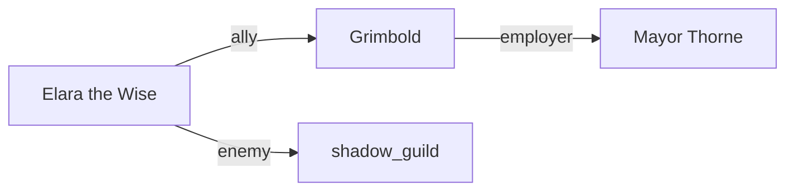

# Quickstart: NPC Relationship Graph

Track connections between NPCs and generate a visual Mermaid diagram.

## Prerequisites

- Campaign initialized (`python scripts/campaign/init_campaign.py "Campaign Name"`)
- At least two NPCs created
- Python 3.11+

## Basic Usage

### 1. Add Relationships via CLI

The easiest way to add relationships is using the CLI:

```bash
python scripts/campaign/campaign_manager.py add-relationship "Elara" "Grimbold" --type ally --description "Childhood friends"
```

This updates both NPC files with the relationship (bidirectional by default).

### 2. Add Relationships Manually

Edit the `## Connections` section in any NPC file:

```markdown
## Connections

- [Grimbold the Blacksmith](grimbold-the-blacksmith.md) | ally | Childhood friend
- [Mayor Thorne](mayor-thorne.md) | employer | Works as enforcer
- The Shadow Guild | enemy | Hunted for past crimes
```

**Format**: `- [Name](file.md) | type | description`

### 3. Generate the Graph

```bash
python scripts/campaign/relationship_graph.py
```

This creates `campaign/relationships.md` with:
- A Mermaid diagram showing all connections
- A list of relationships by NPC
- Links to individual NPC files

## Relationship Types

| Type | Inverse | Description |
|------|---------|-------------|
| ally | ally | Friendly, cooperative |
| enemy | enemy | Hostile, adversarial |
| family | family | Blood or marriage relation |
| employer | employee | Works for this person |
| employee | employer | This person works for them |
| rival | rival | Competitive relationship |
| neutral | neutral | Knows but no strong feelings |
| romantic | romantic | Love interest |
| mentor | student | Teacher/learner relationship |

## CLI Options

### Add Relationship

```bash
# Basic bidirectional relationship
python scripts/campaign/campaign_manager.py add-relationship "NPC A" "NPC B" --type ally

# With description
python scripts/campaign/campaign_manager.py add-relationship "Elara" "Grimbold" --type ally --description "Met in wizard school"

# One-way only (doesn't add inverse)
python scripts/campaign/campaign_manager.py add-relationship "Spy" "Target" --type enemy --one-way
```

### Generate Graph

```bash
# Default output (campaign/relationships.md)
python scripts/campaign/relationship_graph.py

# Custom output file
python scripts/campaign/relationship_graph.py --output custom-graph.md
```

## Example Output

### Mermaid Diagram



### Relationships by NPC

Each NPC section shows their connections:

```markdown
### [Elara the Wise](npcs/elara-the-wise.md)

- [Grimbold](npcs/grimbold.md) (ally) - Childhood friend
- [Mayor Thorne](npcs/mayor-thorne.md) (enemy) - Political rival
```

## Tips

- Use `--one-way` for relationships that aren't symmetric (e.g., secret admirers)
- Regenerate the graph after adding new relationships
- The Mermaid diagram renders in GitHub, Cursor, and most markdown viewers
- NPCs without relationships are not shown in the graph

## Troubleshooting

### NPC not found

Check that the NPC exists:

```bash
python scripts/campaign/campaign_manager.py list-npcs
```

### Relationships not appearing

Verify the format in the NPC file:
- Each line must start with `- `
- Pipes `|` separate name, type, and description
- Type is required

### Graph not rendering

Ensure your markdown viewer supports Mermaid diagrams. GitHub and Cursor both do.
