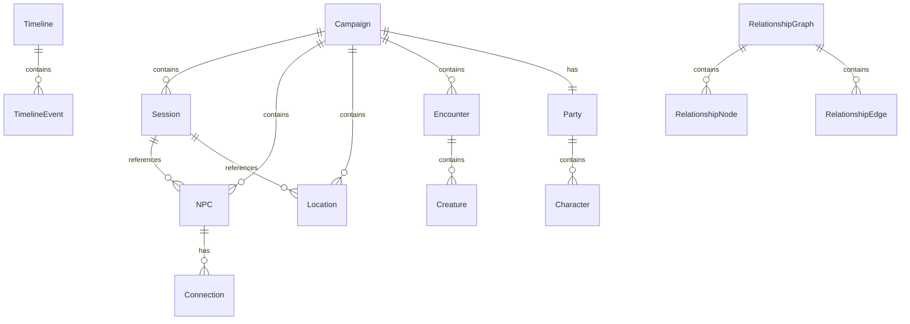

# Data Model: Campaign Web UI

**Feature**: Campaign Web UI  
**Spec**: [spec.md](spec.md)  
**Plan**: [plan.md](plan.md)

## API Response Models

### Campaign

Campaign overview returned by `GET /api/campaign`.

| Field | Type | Description |
|-------|------|-------------|
| name | string | Campaign name |
| setting | string | null | Campaign setting/world |
| current_session | number | Latest session number |
| created | string | ISO date created |
| stats | CampaignStats | Entity counts |

### CampaignStats

| Field | Type | Description |
|-------|------|-------------|
| npcs | number | Total NPC count |
| locations | number | Total location count |
| sessions | number | Total session count |
| encounters | number | Total encounter count |
| party_size | number | Number of party members |

---

### NPCListItem

NPC summary for list views.

| Field | Type | Description |
|-------|------|-------------|
| name | string | NPC name |
| slug | string | URL-safe identifier |
| role | string | ally, neutral, enemy, unknown |
| occupation | string | null | NPC occupation |
| location | string | null | Where NPC is found |
| first_seen | string | null | In-game date first appeared |

### NPCDetail

Full NPC content for detail view.

| Field | Type | Description |
|-------|------|-------------|
| name | string | NPC name |
| slug | string | URL-safe identifier |
| role | string | ally, neutral, enemy, unknown |
| content | string | Full markdown content |
| metadata | NPCMetadata | Extracted metadata |
| connections | Connection[] | Relationships to other NPCs |

### Connection

| Field | Type | Description |
|-------|------|-------------|
| target_name | string | Name of connected NPC |
| target_slug | string | null | Slug if NPC exists |
| type | string | Relationship type |
| description | string | null | Relationship description |

---

### LocationListItem

Location summary for list views.

| Field | Type | Description |
|-------|------|-------------|
| name | string | Location name |
| slug | string | URL-safe identifier |
| type | string | city, dungeon, tavern, etc. |
| region | string | null | Parent region |
| discovered | string | null | In-game date discovered |

### LocationDetail

Full location content for detail view.

| Field | Type | Description |
|-------|------|-------------|
| name | string | Location name |
| slug | string | URL-safe identifier |
| type | string | Location type |
| content | string | Full markdown content |
| metadata | LocationMetadata | Extracted metadata |
| key_npcs | string[] | NPCs at this location |

---

### SessionListItem

Session summary for list views.

| Field | Type | Description |
|-------|------|-------------|
| number | number | Session number |
| title | string | Session title |
| date | string | Real-world date (ISO) |
| in_game_date | string | null | In-game date |

### SessionDetail

Full session content for detail view.

| Field | Type | Description |
|-------|------|-------------|
| number | number | Session number |
| title | string | Session title |
| date | string | Real-world date |
| in_game_date | string | null | In-game date |
| content | string | Full markdown content |
| summary | string | null | Session summary |
| npcs_encountered | string[] | NPCs in this session |
| locations_visited | string[] | Locations in this session |

---

### CharacterListItem

Party member summary.

| Field | Type | Description |
|-------|------|-------------|
| name | string | Character name |
| slug | string | URL-safe identifier |
| player | string | null | Player name |
| species | string | Character species |
| class_info | string | Class and level |
| level | number | Total level |

### CharacterDetail

Full character sheet.

| Field | Type | Description |
|-------|------|-------------|
| name | string | Character name |
| slug | string | URL-safe identifier |
| content | string | Full markdown content |
| metadata | CharacterMetadata | Extracted stats |

---

### EncounterListItem

Encounter summary.

| Field | Type | Description |
|-------|------|-------------|
| name | string | Encounter name |
| slug | string | URL-safe identifier |
| difficulty | string | Easy, Medium, Hard, Deadly |
| total_creatures | number | Number of creatures |
| party_level | number | Party level at creation |

### EncounterDetail

Full encounter details.

| Field | Type | Description |
|-------|------|-------------|
| name | string | Encounter name |
| slug | string | URL-safe identifier |
| content | string | Full markdown content |
| creatures | EncounterCreature[] | Creatures in encounter |
| difficulty | string | Difficulty rating |

---

### TimelineEvent

Event for timeline visualization.

| Field | Type | Description |
|-------|------|-------------|
| in_game_date | string | In-game date (Day N) |
| day | number | Day number for sorting |
| title | string | Event title |
| category | string | session, npc, location, custom |
| session_number | number | null | Related session |
| entity_path | string | null | Path to entity file |
| entity_type | string | null | Type of related entity |

### TimelineResponse

| Field | Type | Description |
|-------|------|-------------|
| current_day | number | Latest day in timeline |
| events | TimelineEvent[] | All events sorted by day |
| days | GroupedDay[] | Events grouped by day |

---

### RelationshipNode

Node in relationship graph.

| Field | Type | Description |
|-------|------|-------------|
| id | string | Slug for node ID |
| name | string | NPC name |
| role | string | null | NPC role |

### RelationshipEdge

Edge in relationship graph.

| Field | Type | Description |
|-------|------|-------------|
| source | string | Source node ID |
| target | string | Target node ID |
| type | string | Relationship type |
| description | string | null | Description |

### RelationshipGraphResponse

| Field | Type | Description |
|-------|------|-------------|
| nodes | RelationshipNode[] | All NPC nodes |
| edges | RelationshipEdge[] | All relationships |
| mermaid | string | Pre-rendered Mermaid code |

---

### ReferenceListItem

Reference data summary.

| Field | Type | Description |
|-------|------|-------------|
| name | string | Entry name |
| slug | string | URL-safe identifier |
| type | string | spells, creatures, items, etc. |
| source | string | Source book code |
| metadata | object | Type-specific metadata |

### ReferenceDetail

Full reference content.

| Field | Type | Description |
|-------|------|-------------|
| name | string | Entry name |
| slug | string | URL-safe identifier |
| type | string | Reference type |
| source | string | Source book |
| content | string | Full markdown content |
| metadata | object | Type-specific metadata |

---

### SearchResult

| Field | Type | Description |
|-------|------|-------------|
| name | string | Result name |
| slug | string | URL-safe identifier |
| type | string | Result type |
| category | string | campaign or reference |
| excerpt | string | null | Text excerpt with match |
| path | string | Navigation path |

### SearchResponse

| Field | Type | Description |
|-------|------|-------------|
| query | string | Search query |
| total | number | Total results |
| results | SearchResult[] | Matched items |
| by_type | object | Results grouped by type |

---

## Frontend Types

```typescript
// Entity types
interface NPC {
  name: string;
  slug: string;
  role: 'ally' | 'neutral' | 'enemy' | 'unknown';
  occupation?: string;
  location?: string;
  firstSeen?: string;
}

interface Location {
  name: string;
  slug: string;
  type: string;
  region?: string;
  discovered?: string;
}

interface Session {
  number: number;
  title: string;
  date: string;
  inGameDate?: string;
}

// Navigation
interface BreadcrumbItem {
  label: string;
  path: string;
}

// Theme
type Theme = 'light' | 'dark' | 'system';
```

## Relationships


