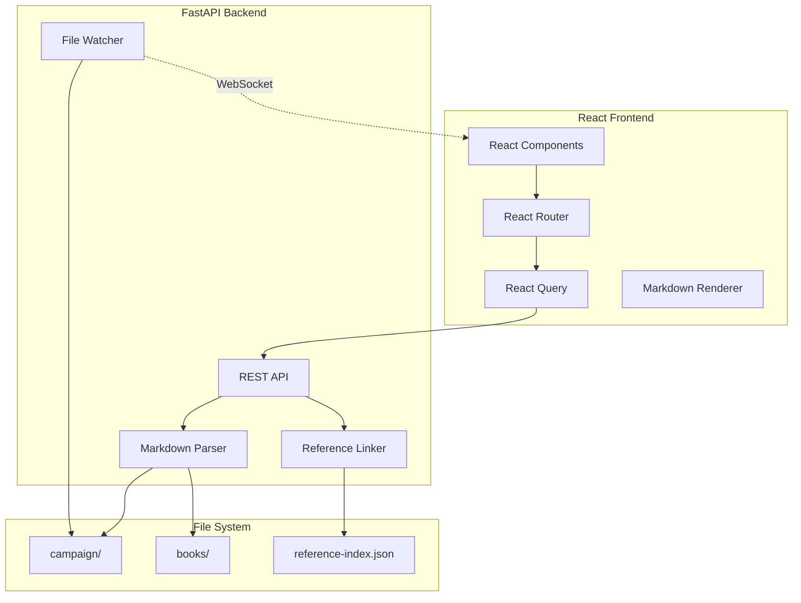

# Plan: Campaign Web UI

**Feature**: Campaign Web UI  
**Spec**: [spec.md](spec.md)

## Architecture



## Directory Structure

```
5e-cursor/
├── frontend/                    # React application
│   ├── src/
│   │   ├── components/         # Reusable UI components
│   │   │   ├── layout/        # Header, Sidebar, Layout
│   │   │   ├── markdown/      # MarkdownViewer, RefTooltip
│   │   │   ├── entities/      # NPCCard, LocationCard, etc.
│   │   │   ├── ui/            # Button, Badge, Card primitives
│   │   │   └── visualizations/# Timeline, RelationshipGraph
│   │   ├── pages/             # Route-based pages
│   │   ├── styles/            # Global and shared styles
│   │   │   ├── globals.css
│   │   │   ├── variables.css
│   │   │   └── typography.css
│   │   ├── services/          # API client
│   │   ├── hooks/             # Custom React hooks
│   │   └── types/             # TypeScript interfaces
│   ├── package.json
│   └── vite.config.ts
├── scripts/
│   └── web/                   # FastAPI backend
│       ├── api/
│       │   ├── campaign.py
│       │   ├── entities.py
│       │   ├── reference.py
│       │   └── search.py
│       ├── models/            # Pydantic models
│       ├── services/          # Business logic
│       └── main.py
└── specs/
    └── 8-campaign-web-ui/
```

## Tech Stack

### Backend
- FastAPI - REST API framework
- Pydantic - Request/response validation
- Watchdog - File system change detection
- mistune - Markdown parsing
- uvicorn - ASGI server

### Frontend
- React 18 with TypeScript
- Vite - Build tool and dev server
- React Router v6 - Client-side routing
- TanStack Query - Data fetching and caching
- TailwindCSS - Utility-first CSS
- CSS Modules - Component-scoped styles
- Lucide React - Icons
- react-markdown + remark-gfm - Markdown rendering
- Mermaid - Diagram rendering
- Radix UI - Accessible primitives

## API Design

### Campaign Core
- `GET /api/campaign` - Campaign overview
- `GET /api/campaign/context` - Full context

### Entities
- `GET /api/npcs` - List all NPCs
- `GET /api/npcs/{slug}` - NPC detail
- `GET /api/locations` - List all locations
- `GET /api/locations/{slug}` - Location detail
- `GET /api/sessions` - List all sessions
- `GET /api/sessions/{number}` - Session detail
- `GET /api/party` - Party overview
- `GET /api/party/characters/{slug}` - Character detail
- `GET /api/encounters` - List encounters
- `GET /api/encounters/{slug}` - Encounter detail

### Visualizations
- `GET /api/timeline` - Timeline events
- `GET /api/relationships` - Relationship graph data

### Reference Data
- `GET /api/reference` - Reference index stats
- `GET /api/reference/search` - Search references
- `GET /api/reference/{type}` - List by type
- `GET /api/reference/{type}/{slug}` - Reference detail

### Utilities
- `GET /api/search` - Full-text search
- `WebSocket /api/ws/changes` - File change notifications

## Implementation Phases

### Phase 1: Foundation
- FastAPI backend scaffold
- React/Vite frontend scaffold
- Basic campaign endpoint and dashboard

### Phase 2: Entity Navigation
- NPC, Location, Session endpoints and pages
- Markdown rendering with styling

### Phase 3: Cross-References
- Internal link conversion
- Party and character views
- Encounter views

### Phase 4: Reference Browser
- Reference search endpoint
- Spells/creatures/items browser
- Hover tooltips

### Phase 5: Visualizations
- Timeline view
- Relationship graph

### Phase 6: Polish
- Global search (Cmd+K)
- Live reload via WebSocket
- Dark mode
- Responsive design

## Reusing Existing Code

The backend imports existing Python modules:
- `scripts/lib/reference_linker.py` - Reference lookups
- `scripts/lib/markdown_writer.py` - Slug utilities
- `scripts/lib/campaign_calendar.py` - Date parsing
- `scripts/lib/relationship_parser.py` - Relationship parsing
- `scripts/campaign/campaign_manager.py` - Entity access
- `scripts/campaign/timeline_generator.py` - Timeline data
- `scripts/campaign/relationship_graph.py` - Graph data

## Dependencies

### Python (requirements.txt additions)
```
fastapi>=0.109.0
uvicorn>=0.27.0
watchdog>=4.0.0
python-multipart>=0.0.6
mistune>=3.0.0
websockets>=12.0
```

### Node (frontend/package.json)
```json
{
  "dependencies": {
    "react": "^18.2.0",
    "react-dom": "^18.2.0",
    "react-router-dom": "^6.22.0",
    "@tanstack/react-query": "^5.17.0",
    "lucide-react": "^0.344.0",
    "react-markdown": "^9.0.0",
    "remark-gfm": "^4.0.0",
    "mermaid": "^10.7.0",
    "@radix-ui/react-tooltip": "^1.0.0",
    "@radix-ui/react-dialog": "^1.0.0",
    "cmdk": "^0.2.0",
    "clsx": "^2.1.0"
  },
  "devDependencies": {
    "typescript": "^5.3.0",
    "vite": "^5.0.0",
    "@vitejs/plugin-react": "^4.2.0",
    "@types/react": "^18.2.0",
    "@types/react-dom": "^18.2.0",
    "tailwindcss": "^3.4.0",
    "postcss": "^8.4.0",
    "autoprefixer": "^10.4.0",
    "eslint": "^8.56.0",
    "prettier": "^3.2.0"
  }
}
```
